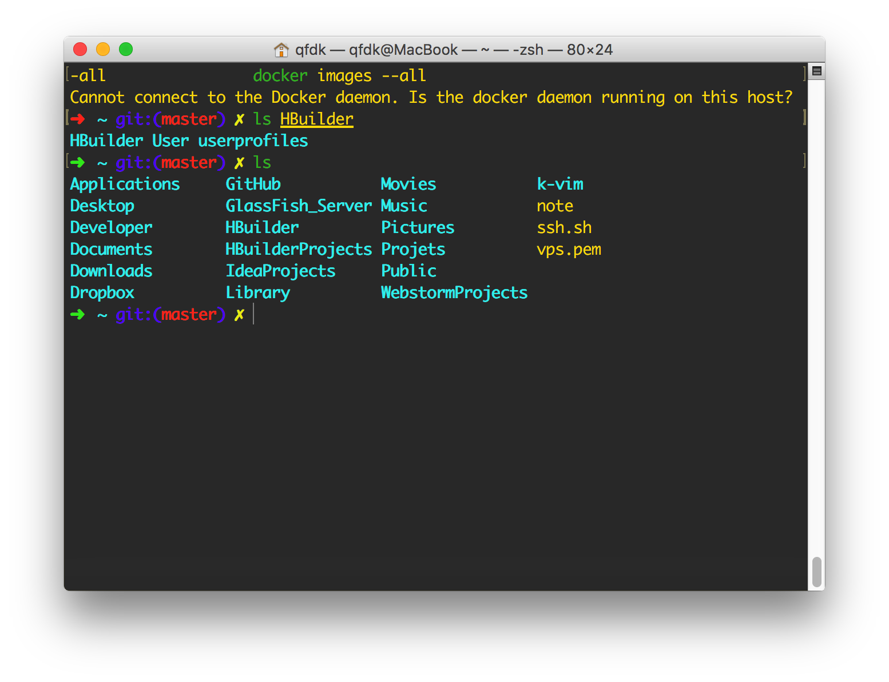

## My dotfiles


### Usage

电脑里面的备份，前提要安装`zsh`重要事情说几遍。
剩下的基本就是自动完成了，没有什么高难度动作。

```bash
git clone https://github.com/qfdk/dotfiles.git dotfiles  
rm -rf .bash_profile .zshrc  
ln -s dotfiles/bash_profile .bash_profile  
ln -s dotfiles/zshrc .zshrc  
```

### 效果图



基本还是挺好看的，好了就先这样。以后慢慢修改。